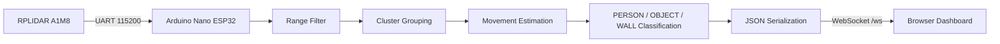

# Software Architecture

## Pipeline



## Firmware Modules

| Module | Responsibility |
|---|---|
| Scan collection | Reads RPLIDAR angle/distance points from UART |
| Filtering | Removes zero-distance and out-of-range readings |
| Clustering | Groups nearby points using a gap threshold |
| Classification | Labels moving human-width clusters as `PERSON` |
| Serialization | Converts point and cluster data into JSON |
| Web server | Serves dashboard and broadcasts scan payloads |

## Classification Rule

The firmware uses a simple rule-based classifier:

```text
if cluster is moving and 300 mm <= width <= 1000 mm:
    label = PERSON
elif width >= 1800 mm:
    label = WALL
else:
    label = OBJECT
```

This is intentionally lightweight because the ESP32 has limited processing resources.

## Dashboard

The dashboard is a single-page HTML/JavaScript application. It connects to the ESP32 WebSocket endpoint, receives JSON scan packets, converts polar coordinates to Cartesian coordinates, and renders the live point cloud on an HTML5 canvas.
